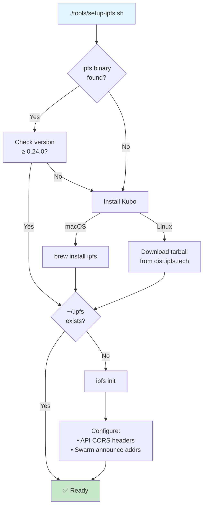
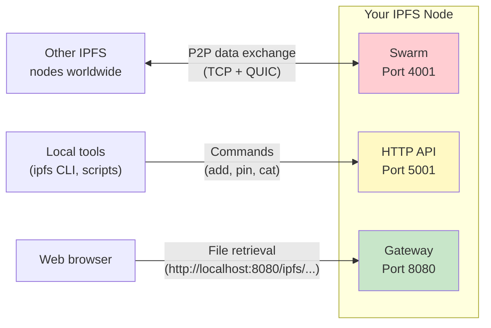

# IPFS Node Setup Guide

> How to install and run an IPFS node for the LFS-IPFS bridge.

This guide walks you through setting up a local IPFS node so you can add, pin,
and retrieve files from the IPFS network. If you just want to _fetch_ files via
a public gateway (e.g. `dweb.link`), you don't need a local node — but having
one lets you **add** files, **verify** CIDs, and **serve** content to the
network.

---

## Table of Contents

1. [What is Kubo?](#1-what-is-kubo)
2. [Automated Setup](#2-automated-setup)
3. [Manual Installation](#3-manual-installation)
4. [Initialising and Running](#4-initialising-and-running)
5. [Ports and Networking](#5-ports-and-networking)
6. [Firewall Considerations](#6-firewall-considerations)
7. [Verifying Your Node](#7-verifying-your-node)
8. [Running as a System Service](#8-running-as-a-system-service)
9. [Troubleshooting](#9-troubleshooting)

---

## 1. What is Kubo?

[**Kubo**](https://github.com/ipfs/kubo) (formerly `go-ipfs`) is the reference
IPFS implementation, written in Go. It provides:

- `ipfs` CLI — add, pin, fetch, and manage content
- HTTP API (port 5001) — programmatic access
- HTTP Gateway (port 8080) — browser-accessible file retrieval
- Swarm networking (port 4001) — P2P content exchange

When this project's tools run `ipfs add` or `ipfs add --only-hash`, they're
calling Kubo under the hood.

---

## 2. Automated Setup

The repository includes a setup script that handles installation and
initialisation automatically:

```bash
./tools/setup-ipfs.sh
```

**What the script does:**



1. **Detects your OS** (macOS or Linux)
2. **Checks for existing `ipfs` binary** and verifies version ≥ 0.24.0
3. **Installs Kubo** if missing (via Homebrew on macOS, tarball on Linux)
4. **Runs `ipfs init`** if `~/.ipfs` doesn't exist
5. **Configures CORS** for the HTTP API (needed by some web tools)
6. **Prints next steps** (starting the daemon)

> **Note:** The script requires `sudo` on Linux for tarball installation
> to `/usr/local/bin`.

---

## 3. Manual Installation

### macOS (Homebrew)

```bash
# Install
brew install ipfs

# Verify
ipfs --version
# → ipfs version 0.32.1
```

### Linux (tarball)

```bash
# Download the latest release
KUBO_VERSION="v0.32.1"
wget "https://dist.ipfs.tech/kubo/${KUBO_VERSION}/kubo_${KUBO_VERSION}_linux-amd64.tar.gz"

# Extract
tar -xvzf "kubo_${KUBO_VERSION}_linux-amd64.tar.gz"

# Install
cd kubo
sudo bash install.sh

# Verify
ipfs --version
# → ipfs version 0.32.1
```

> **Apple Silicon Macs:** Homebrew handles the architecture automatically.
> If installing manually, download the `darwin-arm64` tarball.

---

## 4. Initialising and Running

### One-time initialisation

```bash
ipfs init
```

This creates `~/.ipfs/` containing:

| File/Dir | Purpose |
|---|---|
| `config` | Node configuration (JSON) |
| `datastore/` | Local block storage |
| `keystore/` | Cryptographic identity keys |

You'll see output like:

```
initializing IPFS node at /Users/you/.ipfs
generating ED25519 keypair...done
peer identity: 12D3KooWAbCdEfGhIjKlMnOpQrStUvWxYz...
```

### Starting the daemon

```bash
ipfs daemon
```

The daemon runs in the foreground. You'll see:

```
Initializing daemon...
API server listening on /ip4/127.0.0.1/tcp/5001
Gateway server listening on /ip4/127.0.0.1/tcp/8080
Swarm listening on /ip4/0.0.0.0/tcp/4001
Daemon is ready
```

> **Tip:** Run in the background with `ipfs daemon &` or use a system
> service (see [Section 8](#8-running-as-a-system-service)).

---

## 5. Ports and Networking

IPFS uses three main ports. Understanding them helps with firewall configuration
and debugging:



| Port | Protocol | Binds to | Purpose |
|------|----------|----------|---------|
| **4001** | TCP + QUIC | `0.0.0.0` (all interfaces) | **Swarm** — P2P connections with other IPFS nodes. Must be reachable for your node to serve content to the network. |
| **5001** | HTTP | `127.0.0.1` (localhost only) | **HTTP API** — Control plane. Used by `ipfs` CLI and scripts. **Never expose to the internet** — it has full write access. |
| **8080** | HTTP | `127.0.0.1` (localhost only) | **Gateway** — Read-only HTTP access to IPFS content. Safe to expose if you want to serve content via HTTP. |

---

## 6. Firewall Considerations

### Minimum Required

For the LFS-IPFS bridge tools to work, you need:

- **Port 5001** accessible from `localhost` (default — no firewall changes needed)
- **Port 4001** open for outbound connections (usually open by default)

### Recommended for Full P2P Participation

To allow other nodes to connect to you (improves network health and speeds up
content distribution):

```bash
# macOS — allow incoming on port 4001
# (macOS firewall usually prompts automatically when ipfs daemon starts)

# Linux (UFW)
sudo ufw allow 4001/tcp
sudo ufw allow 4001/udp    # for QUIC

# Linux (iptables)
sudo iptables -A INPUT -p tcp --dport 4001 -j ACCEPT
sudo iptables -A INPUT -p udp --dport 4001 -j ACCEPT
```

### Security Checklist

| Port | Expose to internet? | Why / Why not |
|------|:---:|---|
| 4001 | ✅ Yes | P2P networking — nodes need to reach you |
| 5001 | ❌ **Never** | Full admin access — add, delete, configure |
| 8080 | ⚠️ Optional | Read-only gateway — safe but uses bandwidth |

---

## 7. Verifying Your Node

### Check node identity

```bash
ipfs id
```

Output (abbreviated):

```json
{
  "ID": "12D3KooWAbCdEfGhIjKlMnOpQrStUvWxYz...",
  "PublicKey": "CAESIJ...",
  "Addresses": [
    "/ip4/192.168.1.100/tcp/4001/p2p/12D3KooW...",
    "/ip4/127.0.0.1/tcp/4001/p2p/12D3KooW..."
  ],
  "AgentVersion": "kubo/0.32.1/",
  "Protocols": ["/ipfs/bitswap/1.2.0", "/ipfs/kad/1.0.0", ...]
}
```

### Check connected peers

```bash
ipfs swarm peers | head -10
```

You should see a list of multiaddresses. If you see at least a few peers,
your node is connected to the network.

```bash
# Count total peers
ipfs swarm peers | wc -l
# Typical: 50-200+ peers
```

### Test content retrieval

```bash
# Fetch a well-known test file from the IPFS network
ipfs cat /ipfs/QmQPeNsJPyVWPFDVHb77w8G42Fvo15z4bG2X8D2GhfbSXc/readme
```

You should see the IPFS readme text. If this works, your node can fetch
content from the network.

### Test content addition

```bash
# Add a test file (doesn't publish to network until another node requests it)
echo "Hello IPFS" | ipfs add --cid-version=1
# → added bafkreiffsgtnic7uebaeuaixgph3pmmq2ywglpylzwrswv5so7m23hyuny
```

---

## 8. Running as a System Service

Running `ipfs daemon` in a terminal is fine for testing, but for production use
you'll want it to start automatically on boot.

### macOS — launchd

Create the plist file:

```bash
mkdir -p ~/Library/LaunchAgents
cat > ~/Library/LaunchAgents/com.ipfs.daemon.plist << 'EOF'
<?xml version="1.0" encoding="UTF-8"?>
<!DOCTYPE plist PUBLIC "-//Apple//DTD PLIST 1.0//EN"
  "http://www.apple.com/DTDs/PropertyList-1.0.dtd">
<plist version="1.0">
<dict>
    <key>Label</key>
    <string>com.ipfs.daemon</string>

    <key>ProgramArguments</key>
    <array>
        <string>/opt/homebrew/bin/ipfs</string>
        <string>daemon</string>
        <string>--migrate</string>
    </array>

    <key>RunAtLoad</key>
    <true/>

    <key>KeepAlive</key>
    <true/>

    <key>StandardOutPath</key>
    <string>/tmp/ipfs-daemon.stdout.log</string>

    <key>StandardErrorPath</key>
    <string>/tmp/ipfs-daemon.stderr.log</string>

    <key>EnvironmentVariables</key>
    <dict>
        <key>IPFS_PATH</key>
        <string>/Users/YOU/.ipfs</string>
    </dict>
</dict>
</plist>
EOF
```

> **Important:** Replace `/Users/YOU/.ipfs` with your actual home directory,
> and verify the `ipfs` binary path with `which ipfs`.

Load and start:

```bash
# Load (starts immediately and on future boots)
launchctl load ~/Library/LaunchAgents/com.ipfs.daemon.plist

# Check status
launchctl list | grep ipfs

# Stop
launchctl unload ~/Library/LaunchAgents/com.ipfs.daemon.plist

# View logs
tail -f /tmp/ipfs-daemon.stdout.log
```

### Linux — systemd

Create the unit file:

```bash
sudo tee /etc/systemd/system/ipfs.service << 'EOF'
[Unit]
Description=IPFS Daemon (Kubo)
After=network.target
Documentation=https://docs.ipfs.tech

[Service]
Type=notify
User=YOUR_USERNAME
Environment="IPFS_PATH=/home/YOUR_USERNAME/.ipfs"
ExecStart=/usr/local/bin/ipfs daemon --migrate
Restart=on-failure
RestartSec=10
LimitNOFILE=65536

# Hardening
NoNewPrivileges=true
ProtectSystem=strict
ProtectHome=read-only
ReadWritePaths=/home/YOUR_USERNAME/.ipfs

[Install]
WantedBy=default.target
EOF
```

> **Important:** Replace `YOUR_USERNAME` with your actual username.

Enable and start:

```bash
# Reload unit files
sudo systemctl daemon-reload

# Enable on boot + start now
sudo systemctl enable --now ipfs

# Check status
sudo systemctl status ipfs

# View logs
journalctl -u ipfs -f
```

---

## 9. Troubleshooting

### `ipfs: command not found`

The binary isn't in your `PATH`.

```bash
# macOS (Homebrew)
echo 'export PATH="/opt/homebrew/bin:$PATH"' >> ~/.zshrc
source ~/.zshrc

# Linux (tarball install)
echo 'export PATH="/usr/local/bin:$PATH"' >> ~/.bashrc
source ~/.bashrc
```

### `Error: lock /Users/you/.ipfs/repo.lock: already locked`

Another IPFS daemon is already running.

```bash
# Find and kill it
ps aux | grep "ipfs daemon"
kill <PID>

# Or, if using launchd
launchctl unload ~/Library/LaunchAgents/com.ipfs.daemon.plist
```

### Daemon starts but no peers connect

1. **Check firewall** — port 4001 must allow outbound (and ideally inbound)
2. **Check connectivity:**
   ```bash
   ipfs swarm peers
   # If empty, try connecting to a bootstrap node manually:
   ipfs bootstrap list | head -1 | xargs ipfs swarm connect
   ```
3. **NAT issues** — if behind a strict NAT, enable relay:
   ```bash
   ipfs config --json Swarm.RelayClient.Enabled true
   ipfs config --json Swarm.EnableAutoRelay true
   # Restart the daemon after config changes
   ```

### `Error: api not running`

The daemon isn't running, or the API port has changed.

```bash
# Start the daemon
ipfs daemon &

# Or check if the API file points to the right address
cat ~/.ipfs/api
# Should show: /ip4/127.0.0.1/tcp/5001
```

### Slow `ipfs add` for large files

This is normal for the first add — IPFS hashes and chunks the file. For a 29 MB
WAV file, expect ~2-5 seconds. To speed up batch operations:

```bash
# Use --pin=false if you don't need immediate pinning
ipfs add --cid-version=1 --pin=false large-file.wav
```

### High disk usage in `~/.ipfs`

IPFS caches fetched content. To reclaim space:

```bash
# Run garbage collection
ipfs repo gc

# Check repo size
ipfs repo stat
```

### Port 5001 / 8080 conflict with another service

```bash
# Change the API port
ipfs config Addresses.API /ip4/127.0.0.1/tcp/5002

# Change the gateway port
ipfs config Addresses.Gateway /ip4/127.0.0.1/tcp/9090

# Restart the daemon
```

---

## Next Steps

- **[Pinata Setup](PINATA-SETUP.md)** — Pin content to a cloud service for 24/7
  availability
- **[LFS-IPFS Bridge Deep Dive](LFS-IPFS-BRIDGE.md)** — Understand how LFS OIDs
  and IPFS CIDs relate
