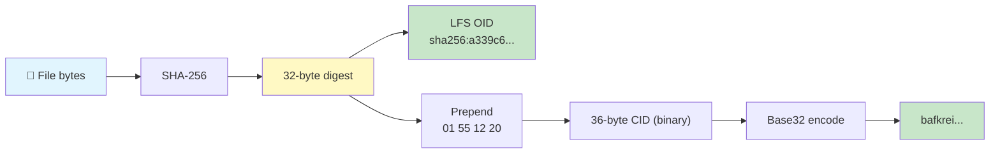
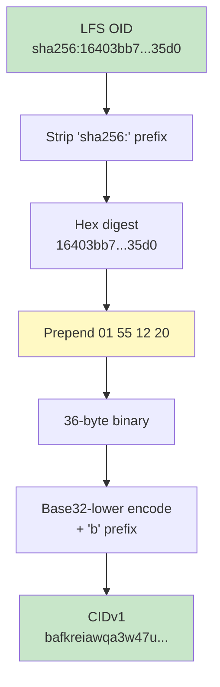
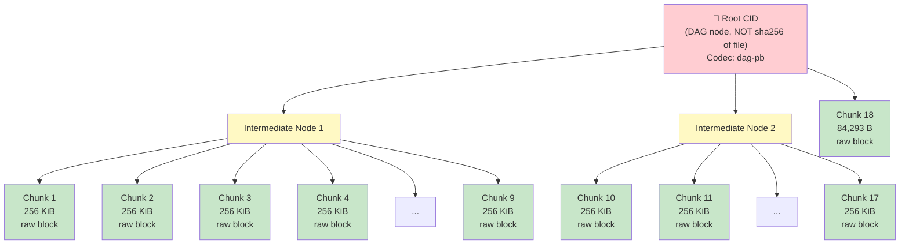
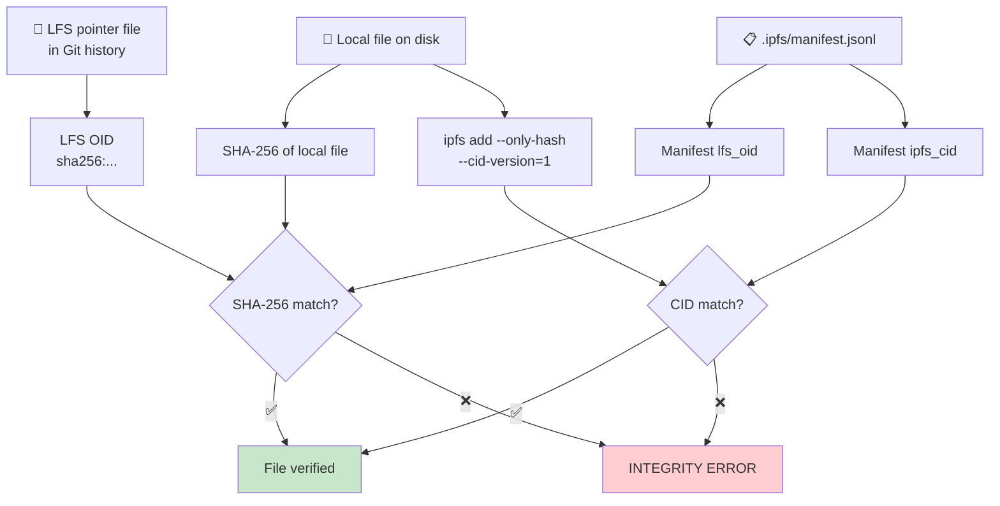

# LFS ↔ IPFS Bridge: Deep Dive

> How content addressing works in Git LFS and IPFS — and why this project uses both.

This document explains the technical foundations of the LFS-IPFS bridge used in
this repository. It is written for developers who know Git but may be new to
IPFS. By the end you will understand:

- How Git LFS and IPFS each identify files by content
- When those identifiers are trivially convertible (and when they are not)
- How the manifest file ties the two worlds together
- How to verify integrity end-to-end

---

## Table of Contents

1. [Content Addressing Compared](#1-content-addressing-compared)
2. [The Small-File Shortcut (≤ 256 KiB)](#2-the-small-file-shortcut--256-kib)
3. [Why Large Files Diverge (> 256 KiB)](#3-why-large-files-diverge--256-kib)
4. [The Manifest as a Rosetta Stone](#4-the-manifest-as-a-rosetta-stone)
5. [Verification Flow](#5-verification-flow)
6. [Use Cases](#6-use-cases)

---

## 1. Content Addressing Compared

Both Git LFS and IPFS are **content-addressed** storage systems. Instead of
naming files by path or URL, they name files by _what_ the file contains. Change
a single byte and the identifier changes.

But they encode that identity differently.

### Git LFS: SHA-256 Hex Digest

When Git LFS stores a file, it computes the **raw SHA-256 hash** of the file's
bytes and records it in a **pointer file** that gets committed to Git:

```
version https://git-lfs.github.com/spec/v1
oid sha256:a339c6e003371bf38de9b111b3cbc66130165dda0f6e4b0c03400bbc82f0b38e
size 284982
```

The identity is the 64-character hex string after `sha256:`. That's it — 32
bytes of SHA-256 digest, hex-encoded.

### IPFS: CIDv1 (Content Identifier, Version 1)

IPFS uses a **self-describing** identifier called a CID. A CIDv1 is built from
multiple fields packed together, then base-encoded:

| Field | Value | Meaning |
|---|---|---|
| CID version | `0x01` | "This is a CIDv1" |
| Content codec | `0x55` | `raw` — raw binary data, no wrapping |
| Hash function | `0x12` | SHA-256 (from the [multicodec table](https://github.com/multiformats/multicodec)) |
| Digest length | `0x20` | 32 bytes (0x20 = 32 in decimal) |
| Digest | 32 bytes | The actual SHA-256 hash |

The resulting binary blob is then **base32-encoded** (lowercase, no padding)
with a `b` prefix to produce the familiar `bafkrei...` string.

### Side-by-Side: Byte-Level Comparison

Below is the byte-level structure for the same file (WindowImage.jpg, 285 KB):

```
┌─────────────────────────────────────────────────────────────┐
│                    Git LFS Pointer File                     │
├─────────────────────────────────────────────────────────────┤
│ version https://git-lfs.github.com/spec/v1                 │
│ oid sha256:a339c6e003371bf38de9b111b3cbc66130165dda0f6e4b.. │
│ size 284982                                                 │
│                                                             │
│ Identity = SHA-256(file content)                            │
│ ┌────────────────────────────────────────────────────────┐  │
│ │ a3 39 c6 e0 03 37 1b f3 8d e9 b1 11 b3 cb c6 61     │  │
│ │ 30 16 5d da 0f 6e 4b 0c 03 40 0b bc 82 f0 b3 8e     │  │
│ └────────────────────────────────────────────────────────┘  │
│                  32 bytes (hex-encoded as 64 chars)         │
└─────────────────────────────────────────────────────────────┘

┌─────────────────────────────────────────────────────────────┐
│                     IPFS CIDv1 (raw)                        │
├─────────────────────────────────────────────────────────────┤
│ ┌──────┬──────┬──────┬──────┬──────────────────────────┐    │
│ │ 0x01 │ 0x55 │ 0x12 │ 0x20 │ <32-byte SHA-256 digest> │    │
│ │ ver  │ raw  │sha256│ 32B  │ (same digest as LFS!)    │    │
│ └──────┴──────┴──────┴──────┴──────────────────────────┘    │
│                                                             │
│ Total: 4 prefix bytes + 32 digest bytes = 36 bytes          │
│ Base32-encode → "bafkrei..." string                         │
└─────────────────────────────────────────────────────────────┘
```



> **Key insight:** Both systems compute `SHA-256(file content)`. The only
> difference is how they encode and present that hash. For files that IPFS
> stores as a single block, the underlying digest is **identical**.

---

## 2. The Small-File Shortcut (≤ 256 KiB)

IPFS's default block size limit is **256 KiB** (262,144 bytes). When a file
fits in a single block, IPFS stores it as-is with the `raw` codec. The CID's
digest is simply `SHA-256(file content)` — the same value LFS already has.

This means **you can construct the IPFS CID from the LFS OID without
touching the file data**.

### Worked Example: WindowImage.jpg (285 KB)

> **Wait — 285 KB > 256 KiB?**
> Actually no. 285 KB = 284,982 bytes. 256 KiB = 262,144 bytes. This file is
> 284,982 bytes, which is above the 256 KiB threshold. So this particular file
> would be chunked. Let's use the 119 KB file `10 - Keys #05.wav` instead for a
> clean single-block example, then show WindowImage.jpg as a borderline case.

Let's use `10 - Keys #05.wav` (119 KB = ~121,856 bytes), whose LFS OID is:

```
oid sha256:16403bb73d8646bd6124cb4f94ecfd5c3a3d80060386266725387ca17bee35d0
```

**Step 1 — Extract the raw SHA-256 digest (32 bytes, hex):**

```
16403bb73d8646bd6124cb4f94ecfd5c3a3d80060386266725387ca17bee35d0
```

**Step 2 — Prepend the CIDv1 header bytes:**

```
Byte:  01    55    12    20    16 40 3b b7 3d 86 46 bd ...
       ──    ──    ──    ──    ─────────────────────────
       │     │     │     │     └─ SHA-256 digest (32 bytes)
       │     │     │     └─ Digest length: 32
       │     │     └─ Hash type: SHA-256
       │     └─ Codec: raw
       └─ CID version: 1
```

Full 36 bytes in hex:

```
01 55 12 20 16 40 3b b7 3d 86 46 bd 61 24 cb 4f
94 ec fd 5c 3a 3d 80 06 03 86 26 67 25 38 7c a1
7b ee 35 d0
```

**Step 3 — Base32-lower encode with `b` prefix:**

```bash
# Using the command line:
echo -n "01551220$(echo -n '16403bb73d8646bd6124cb4f94ecfd5c3a3d80060386266725387ca17bee35d0')" \
  | xxd -r -p \
  | base32 \
  | tr 'A-Z' 'a-z' \
  | tr -d '=' \
  | sed 's/^/b/'
```

Result: `bafkreiawqa3w47umi26sfje4t6jz7k4dru6aamdaysmojjy6fkb26hrzuq`

**Step 4 — Verify:**

```bash
# If you have the file locally and the IPFS CLI:
ipfs add --only-hash --cid-version=1 "10 - Keys #05.wav"
# Should output the same CID!
```

### The Conversion at a Glance



> **This only works for files ≤ 256 KiB.** For larger files, read on.

---

## 3. Why Large Files Diverge (> 256 KiB)

Most files in this repo are audio recordings — WAV files ranging from 1 MB to
29 MB. For these, IPFS does **not** store the file as a single block.

### How IPFS Chunks Large Files

When you `ipfs add` a file larger than 256 KiB, IPFS:

1. **Splits** the file into 256 KiB (262,144 byte) chunks
2. **Hashes** each chunk individually → each chunk gets its own CID
3. **Builds a Merkle DAG** — a tree structure where intermediate nodes link to
   chunks (and possibly other intermediate nodes)
4. **Returns the root CID** — the CID of the root node

The root CID is the hash of the **DAG node that describes the tree structure**,
not the hash of the file content. Therefore:

> **Root CID ≠ SHA-256(file content) ≠ LFS OID**

### Example: `10 - Keys #01.wav` (4.5 MB)

This file is 4,540,741 bytes. At 262,144 bytes per chunk:

- 4,540,741 ÷ 262,144 = **17.3** → **18 chunks**
- 17 full chunks of 262,144 bytes + 1 partial chunk of 84,293 bytes



Each leaf chunk's CID **is** `SHA-256(chunk bytes)`, but the root CID is
`SHA-256(protobuf-encoded DAG node)` — a completely different value from the
LFS OID.

### Why Can't We Just Derive One from the Other?

| Property | LFS OID | IPFS Root CID |
|---|---|---|
| **Input to hash** | Entire file as one blob | Protobuf-encoded DAG node (links to child CIDs) |
| **Hash algorithm** | SHA-256 | SHA-256 (same algo, different input!) |
| **Depends on** | File content only | File content + chunk size + DAG layout |
| **Deterministic?** | Yes | Yes (given same chunker settings) |
| **Convertible?** | ❌ Not without the file data | ❌ Not without the file data |

This is why we need the **manifest** — to store the mapping between the two
identifiers for every file, regardless of size.

---

## 4. The Manifest as a Rosetta Stone

The file `.ipfs/manifest.jsonl` is the bridge between LFS and IPFS. It is a
**JSONL** (JSON Lines) file — one JSON object per line, one line per file.

### Format

Each line contains:

| Field | Type | Description |
|---|---|---|
| `path` | string | Repo-relative file path |
| `lfs_oid` | string | Full LFS OID (`sha256:...`) |
| `ipfs_cid` | string | IPFS CIDv1 (base32, `bafk...` or `bafy...`) |
| `size` | number | File size in bytes |
| `added` | string | ISO 8601 timestamp of when the entry was added |
| `pinata_id` | string | Pinata pin ID (if pinned), or `null` |

### Example Entries

```jsonl
{"path":"projects/logic/9May11am/Audio Files/10 - Keys #05.wav","lfs_oid":"sha256:16403bb73d8646bd6124cb4f94ecfd5c3a3d80060386266725387ca17bee35d0","ipfs_cid":"bafkreiawqa3w47umi26sfje4t6jz7k4dru6aamdaysmojjy6fkb26hrzuq","size":121856,"added":"2026-05-28T09:00:00Z","pinata_id":null}
{"path":"projects/logic/9May11am/Audio Files/10 - Keys #01.wav","lfs_oid":"sha256:49186c526d247603d5209adde60c1c230b0f3a253eb9a120ea31612a01238249","ipfs_cid":"bafybeig5h3ylkwrn7qvp2nba6hxr4ek7m2c7kdp3txf4g9qlmea2j5rmzi","size":4540741,"added":"2026-05-28T09:00:00Z","pinata_id":"abc123def456"}
{"path":"projects/logic/9May11am/9May11am.logicx/Alternatives/000/WindowImage.jpg","lfs_oid":"sha256:a339c6e003371bf38de9b111b3cbc66130165dda0f6e4b0c03400bbc82f0b38e","ipfs_cid":"bafybeifrzogcobn7puz4mw4rin4xlymacvhpmgoofhhjyaocaau6qf4lhry","size":284982,"added":"2026-05-28T09:00:00Z","pinata_id":null}
```

> **Why JSONL, not JSON?** JSONL (one object per line) is trivially appendable,
> `grep`-able, and `jq`-streamable. Adding a new file means appending one line
> — no need to parse/rewrite an entire JSON array. It's also friendly to
> `git diff`.

### CID Prefixes Cheat Sheet

| CID prefix | Meaning | When you'll see it |
|---|---|---|
| `bafkrei...` | CIDv1, raw codec, single block | Files ≤ 256 KiB |
| `bafybei...` | CIDv1, dag-pb codec, multi-block | Files > 256 KiB (chunked) |

---

## 5. Verification Flow

The `tools/verify-hashes.sh` script performs end-to-end integrity checks. It
verifies that **three identities agree**:



### What the Script Checks

For each file listed in the manifest:

1. **SHA-256(local file) = LFS OID in pointer file = `lfs_oid` in manifest**
   - Ensures the file on disk is exactly what Git LFS tracks
   - Catches corruption, truncation, or wrong-file errors

2. **`ipfs add --only-hash --cid-version=1 <file>` = `ipfs_cid` in manifest**
   - `--only-hash` computes the CID without actually adding to IPFS
   - Verifies the manifest CID matches what IPFS would produce
   - Catches CID calculation errors or manifest staleness

### Running Verification

```bash
# Verify all files in the manifest
./tools/verify-hashes.sh

# Verify a specific file
./tools/verify-hashes.sh "projects/logic/9May11am/Audio Files/10 - Keys #01.wav"
```

Example output:

```
Verifying 319 files...

[  1/319] ✅ projects/logic/9May11am/Audio Files/10 - Keys #01.wav
           LFS: sha256:49186c52... ✓
           CID: bafybeig5h3ylk... ✓
[  2/319] ✅ projects/logic/9May11am/Audio Files/10 - Keys #02.wav
           LFS: sha256:62a36038... ✓
           CID: bafybeicnrtkd2... ✓
...
[319/319] ✅ raw-video/scene-04.mov
           LFS: sha256:8f3a21b0... ✓
           CID: bafybeih7xkr4e... ✓

━━━━━━━━━━━━━━━━━━━━━━━━━━━━━━━
  319 passed  ·  0 failed
━━━━━━━━━━━━━━━━━━━━━━━━━━━━━━━
```

---

## 6. Use Cases

Why bother mirroring LFS content on IPFS?

### 🔁 Redundancy

LFS content lives on a single server (Google Cloud Run + GCS in our case). If
that server goes down, all `git lfs pull` operations fail. IPFS provides a
second, independent retrieval path.

| Scenario | LFS-only | LFS + IPFS |
|---|---|---|
| LFS server down | ❌ Can't fetch files | ✅ Fetch via any IPFS gateway |
| GCS bucket deleted | ❌ Data lost | ✅ Data recoverable from IPFS network |
| Cloud bill unpaid | ❌ Service suspended | ✅ IPFS peers still serve content |

### 🌐 Sharing Without Credentials

LFS requires either public-read configuration or credentials. IPFS content is
available to anyone with the CID:

```bash
# Anyone can fetch this — no credentials, no account, no server config:
curl "https://dweb.link/ipfs/bafybeig5h3ylkwrn7qvp2nba6hxr4ek7m2c7kdp3txf4g9qlmea2j5rmzi" -o keys01.wav
```

### 📌 Permanence via Pinata

Local IPFS nodes only keep content while they're online. [Pinata](https://pinata.cloud)
is a **pinning service** that keeps your content available 24/7:

- **Free tier**: 1 GB of pinned content
- Content persists even when your local IPFS node is offline
- Accessible via Pinata's fast CDN gateway

### 🔗 Decentralization

LFS is centralized by design — one server, one operator. IPFS is a P2P
network. Once content is on IPFS, any node that pins it becomes a mirror.
There is no single point of failure.

### 🏷️ Provenance & Integrity

CIDs are **tamper-evident**. If someone gives you a CID, you can verify that
the data you received matches that CID — the verification is built into the
protocol. Combined with Git's own commit history and LFS OIDs, you get a
complete chain of provenance:

```
Git commit → LFS pointer (sha256:...) → manifest → IPFS CID → file bytes
```

Every link in this chain is cryptographically verifiable.

---

## Further Reading

- [IPFS Docs: Content Addressing](https://docs.ipfs.tech/concepts/content-addressing/)
- [CID Inspector](https://cid.ipfs.tech/) — paste a CID to decode its fields
- [Git LFS Spec](https://github.com/git-lfs/git-lfs/blob/main/docs/spec.md)
- [Multiformats / Multicodec Table](https://github.com/multiformats/multicodec/blob/master/table.csv)
- [Pinata Docs](https://docs.pinata.cloud/)
- [IPFS Setup Guide](IPFS-SETUP.md)
- [Pinata Setup Guide](PINATA-SETUP.md)
