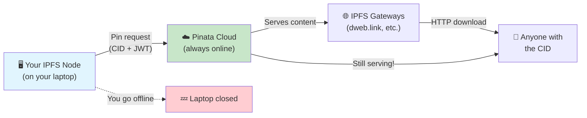
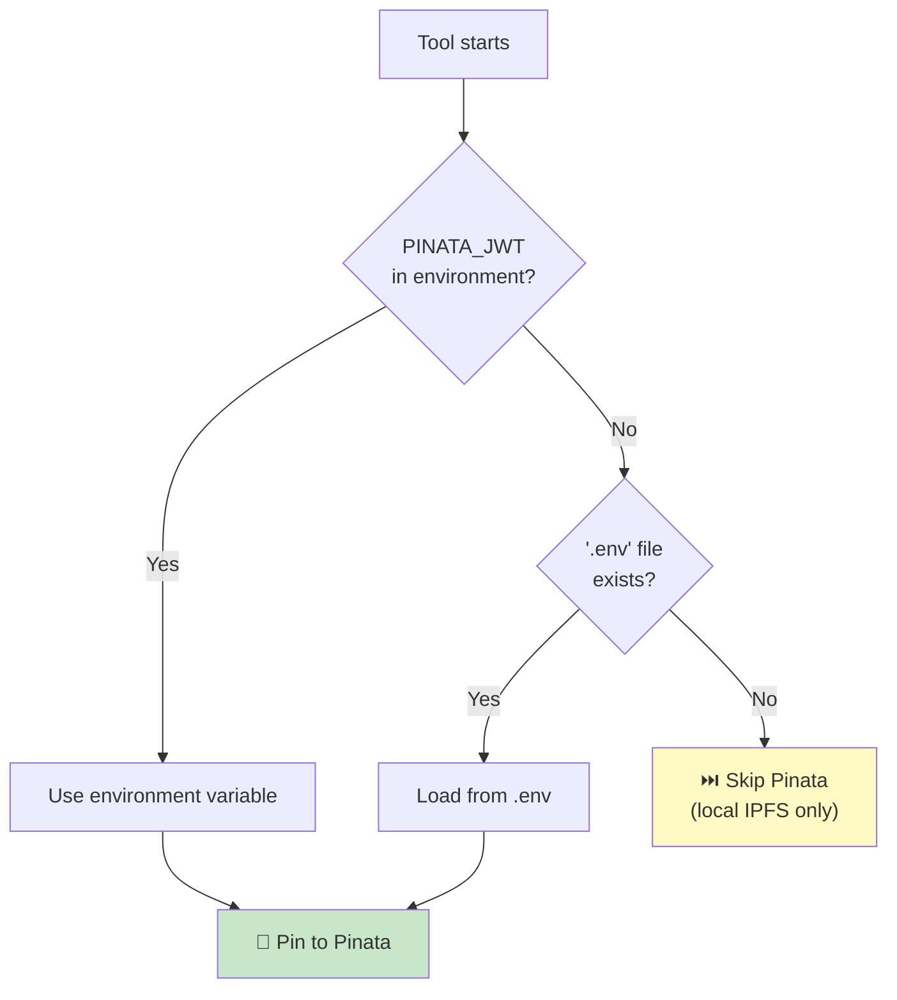

# Pinata Setup Guide

> Pin your IPFS content to the cloud so it's available 24/7 — even when your
> local node is offline.

---

## Table of Contents

1. [What is Pinata?](#1-what-is-pinata)
2. [Why Use Pinata?](#2-why-use-pinata)
3. [Account Creation](#3-account-creation)
4. [API Key Generation](#4-api-key-generation)
5. [Local Configuration](#5-local-configuration)
6. [Pinning Content](#6-pinning-content)
7. [Verifying Pins](#7-verifying-pins)
8. [Retrieving Content via Gateway](#8-retrieving-content-via-gateway)
9. [Pricing](#9-pricing)
10. [Security Best Practices](#10-security-best-practices)

---

## 1. What is Pinata?

IPFS is a peer-to-peer network — content is only available while at least one
node is actively hosting it. When you shut down your laptop, your IPFS node goes
offline, and your content becomes unreachable.

**Pinata** is an **IPFS pinning service**. It runs IPFS nodes in the cloud that
keep your content pinned (stored and available) 24/7. Think of it as "cloud
storage for IPFS" — you upload a CID, and Pinata ensures someone is always
serving it.



---

## 2. Why Use Pinata?

| Without Pinata | With Pinata |
|---|---|
| Content disappears when your node goes offline | Content available 24/7 |
| Depends on your laptop's uptime and bandwidth | Served from Pinata's CDN infrastructure |
| Other nodes _might_ cache your content (no guarantee) | Guaranteed pinning with SLA |
| No dashboard or management UI | Web dashboard to manage pins |
| Free (but unreliable) | Free tier: 1 GB, paid plans for more |

> **Pinata is optional.** The LFS-IPFS bridge works without it — you'll just
> need your local IPFS node to be running for content to be available on the
> IPFS network.

---

## 3. Account Creation

1. Go to [**https://app.pinata.cloud**](https://app.pinata.cloud)
2. Click **Sign Up**
3. Create an account with email or GitHub OAuth
4. Verify your email if prompted
5. You'll land on the Pinata dashboard

> **Free tier** gives you 1 GB of pinned storage — enough to test with a
> subset of this project's files.

---

## 4. API Key Generation

The bridge tools authenticate with Pinata using a **JWT (JSON Web Token)**.

### Steps

1. Log into [**https://app.pinata.cloud**](https://app.pinata.cloud)
2. Navigate to **Developers → API Keys**
   ([direct link](https://app.pinata.cloud/developers/api-keys))
3. Click **+ New Key**
4. Configure the key:

   | Setting | Value |
   |---|---|
   | Key type | **Admin** (or create scoped permissions — see below) |
   | Key name | `nozzles-lfs-bridge` (or any descriptive name) |

5. Click **Create Key**
6. **Copy the JWT** — this is shown only once!

```
┌─────────────────────────────────────────────────────────┐
│  API Key:    abc123...                                  │
│  API Secret: def456...                                  │
│  JWT:        eyJhbGciOiJIUzI1NiIsInR5cCI6IkpXVCJ9...   │  ← Copy this one
└─────────────────────────────────────────────────────────┘
```

> **You need the JWT**, not the API Key or API Secret. The bridge tools use
> the JWT for Bearer token authentication.

### Scoped Permissions (Optional)

If you prefer a least-privilege key, enable only:

- ✅ `pinByHash` — pin existing IPFS content by CID
- ✅ `pinFileToIPFS` — upload and pin new content
- ✅ `pinList` — list existing pins
- ✅ `unpin` — remove pins

---

## 5. Local Configuration

### Option A: Environment Variable (Recommended)

```bash
# Add to your shell profile (~/.zshrc, ~/.bashrc, etc.)
export PINATA_JWT="eyJhbGciOiJIUzI1NiIsInR5cCI6IkpXVCJ9.eyJ1c2VySW5mb3JtYXRpb24iOnsiaWQiOi..."
```

Reload your shell:

```bash
source ~/.zshrc   # or ~/.bashrc
```

### Option B: `.env` File

Create a `.env` file in the repository root:

```bash
# .env — Pinata credentials (DO NOT COMMIT)
PINATA_JWT=eyJhbGciOiJIUzI1NiIsInR5cCI6IkpXVCJ9.eyJ1c2VySW5mb3JtYXRpb24iOnsiaWQiOi...
```

> **⚠️ The `.env` file must be in `.gitignore`!** Verify:
> ```bash
> grep '.env' .gitignore
> ```
> If not present, add it:
> ```bash
> echo '.env' >> .gitignore
> ```

### Verify Configuration

```bash
# Quick test — should return your account info
curl -s "https://api.pinata.cloud/data/testAuthentication" \
  -H "Authorization: Bearer ${PINATA_JWT}" | jq .
```

Expected output:

```json
{
  "message": "Congratulations! You are communicating with the Pinata API!"
}
```

---

## 6. Pinning Content

### Pin All Files

```bash
./tools/pinata-pin.sh --all
```

This script:

1. Reads every entry from `.ipfs/manifest.jsonl`
2. For each CID, calls the Pinata "Pin by CID" API
3. Updates the manifest with the `pinata_id` for each successful pin
4. Reports progress and any failures

```
Pinning 319 files to Pinata...

[  1/319] 📌 10 - Keys #01.wav → bafybeig5h3ylk...  ✅ pinned
[  2/319] 📌 10 - Keys #02.wav → bafybeicnrtkd2...  ✅ pinned
[  3/319] 📌 10 - Keys #03.wav → bafkreif7xkr4e...  ✅ pinned
...
[319/319] 📌 scene-04.mov → bafybeih7xkr4e...       ✅ pinned

━━━━━━━━━━━━━━━━━━━━━━━━━━━━━━━
  319 pinned  ·  0 failed
  Total size: ~5.7 GB
━━━━━━━━━━━━━━━━━━━━━━━━━━━━━━━
```

### Pin a Single File

```bash
# Pin by file path
./tools/pinata-pin.sh "projects/logic/9May11am/Audio Files/10 - Keys #01.wav"
```

### Pin by CID Directly

```bash
# Using curl directly (useful for testing)
curl -s -X POST "https://api.pinata.cloud/pinning/pinByHash" \
  -H "Authorization: Bearer ${PINATA_JWT}" \
  -H "Content-Type: application/json" \
  -d '{
    "hashToPin": "bafybeig5h3ylkwrn7qvp2nba6hxr4ek7m2c7kdp3txf4g9qlmea2j5rmzi",
    "pinataMetadata": {
      "name": "10 - Keys #01.wav"
    }
  }' | jq .
```

---

## 7. Verifying Pins

### Via the Pinata Dashboard

1. Log into [**https://app.pinata.cloud**](https://app.pinata.cloud)
2. Go to **Files** (or **Pin Manager** in older UI)
3. You should see all your pinned CIDs listed with their names and sizes

### Via the API

```bash
# List recent pins
curl -s "https://api.pinata.cloud/data/pinList?status=pinned&pageLimit=5" \
  -H "Authorization: Bearer ${PINATA_JWT}" | jq '.rows[] | {name: .metadata.name, cid: .ipfs_pin_hash, size: .size}'
```

### Check a Specific CID

```bash
# Check pin status for a specific CID
CID="bafybeig5h3ylkwrn7qvp2nba6hxr4ek7m2c7kdp3txf4g9qlmea2j5rmzi"
curl -s "https://api.pinata.cloud/data/pinList?status=pinned&hashContains=${CID}" \
  -H "Authorization: Bearer ${PINATA_JWT}" | jq '.count'
# Should return 1
```

---

## 8. Retrieving Content via Gateway

Once pinned, files are accessible through Pinata's dedicated gateway and any
public IPFS gateway:

### Pinata Gateway

```bash
# Direct download via Pinata's gateway
curl "https://gateway.pinata.cloud/ipfs/bafybeig5h3ylkwrn7qvp2nba6hxr4ek7m2c7kdp3txf4g9qlmea2j5rmzi" \
  -o "10 - Keys #01.wav"
```

### Public IPFS Gateways

```bash
# dweb.link (Protocol Labs)
curl "https://dweb.link/ipfs/bafybeig5h3ylkwrn7qvp2nba6hxr4ek7m2c7kdp3txf4g9qlmea2j5rmzi" \
  -o "10 - Keys #01.wav"

# ipfs.io
curl "https://ipfs.io/ipfs/bafybeig5h3ylkwrn7qvp2nba6hxr4ek7m2c7kdp3txf4g9qlmea2j5rmzi" \
  -o "10 - Keys #01.wav"

# cloudflare-ipfs.com
curl "https://cloudflare-ipfs.com/ipfs/bafybeig5h3ylkwrn7qvp2nba6hxr4ek7m2c7kdp3txf4g9qlmea2j5rmzi" \
  -o "10 - Keys #01.wav"
```

### In a Web Browser

Simply paste into your browser's address bar:

```
https://gateway.pinata.cloud/ipfs/bafybeig5h3ylkwrn7qvp2nba6hxr4ek7m2c7kdp3txf4g9qlmea2j5rmzi
```

> **Tip:** Pinata's gateway is fastest for Pinata-pinned content. Public
> gateways work too but may be slower on first fetch.

---

## 9. Pricing

Pinata offers tiered pricing (as of 2026):

| Plan | Storage | Bandwidth | Price |
|---|---|---|---|
| **Free** | 1 GB | 10 GB / month | $0 |
| **Picnic** | 25 GB | 50 GB / month | ~$20 / month |
| **Fiesta** | 250 GB | 500 GB / month | ~$100 / month |
| **Enterprise** | Custom | Custom | Contact sales |

### What This Project Needs

This repo has **319 LFS files totalling ~5.7 GB**. To pin everything:

- **Free tier (1 GB):** Enough for ~55 files. Good for testing with a subset.
- **Picnic (25 GB):** Comfortably fits the entire repo with room to grow.

> **Tip:** Start with the free tier to test the workflow. Pin your most
> important files first (final mixes, master recordings) and upgrade if you
> decide to pin everything.

### Checking Your Usage

```bash
curl -s "https://api.pinata.cloud/data/userPinnedDataTotal" \
  -H "Authorization: Bearer ${PINATA_JWT}" | jq .
```

---

## 10. Security Best Practices

### Never Commit API Keys

```bash
# Your .gitignore should contain:
.env
*.env
.env.*
```

Verify your JWT isn't in any committed files:

```bash
# Search for potential leaked tokens
git log --all -p -S "eyJhbGciOi" -- . | head -20
# Should return nothing
```

### Use Scoped API Keys

Instead of an Admin key, create a key with only the permissions the tools need:

- ✅ `pinByHash` — pin by CID
- ✅ `pinFileToIPFS` — upload and pin
- ✅ `pinList` — list pins
- ❌ `userPinPolicy` — not needed
- ❌ `pinJobs` — not needed

### Rotate Keys Periodically

1. Create a new key in the Pinata dashboard
2. Update your `PINATA_JWT` environment variable
3. Revoke the old key in the dashboard

### Environment Variable Precedence

The tools check for `PINATA_JWT` in this order:

1. Shell environment variable (`export PINATA_JWT=...`)
2. `.env` file in the repository root
3. If neither is found, Pinata operations are **skipped** (not an error)



---

## Next Steps

- **[IPFS Node Setup](IPFS-SETUP.md)** — Set up a local IPFS node (required
  before pinning)
- **[LFS-IPFS Bridge Deep Dive](LFS-IPFS-BRIDGE.md)** — Understand the
  relationship between LFS OIDs and IPFS CIDs
- **[Manifest README](../.ipfs/README.md)** — Quick reference for the manifest
  file
